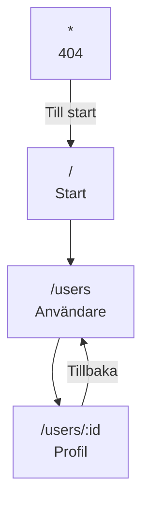

# Planering

Status: utkast, 30 september 2026. Inlämning 6 oktober kl. 23:59. Redovisning 7 oktober kl. 09:00.

## Sitemap



| Route | Sida | Innehåll |
|---|---|---|
| `/` | Start | Kort om appen, antal användare, fördelning per roll och en länk till listan. |
| `/users` | Användare | Alla användare som kort: namn, användarnamn, stad och roller. Sök på namn och filter på roll. |
| `/users/:id` | Profil | Namn, e-post, adress, roller, tema och notisinställningar. Hanterar id som inte finns. |
| `*` | 404 | Sidan finns inte, med länk till start. |

Kravet är minst två vyer. `/users` och `/users/:id` räcker för det. Startsidan och sök/filter är bonus och kan strykas om tiden blir kort.

## API

- Endpoint: `GET https://api-userapi.onrender.com/api/users/getUsers`
- Header: `x-api-key`, med värdet från miljövariabeln `VITE_API_KEY` (se nedan)
- Svaret är en array med 10 användare. Det finns ingen endpoint för en enskild användare.
- Gräns: max 100 anrop per dag.

Kontrollerat 30 september: svaret har formen nedan.

```json
{
  "id": 1,
  "username": "annak",
  "profile": {
    "name": "Anna Karlsson",
    "email": "anna.karlsson@example.com",
    "address": { "street": "Storgatan 12", "city": "Stockholm", "zipCode": "111 22" }
  },
  "settings": {
    "theme": "dark",
    "notifications": { "email": true, "push": false }
  },
  "roles": ["user", "admin"]
}
```

## Datamodell (TypeScript)

```ts
export interface Address {
  street: string;
  city: string;
  zipCode: string;
}

export interface Profile {
  name: string;
  email: string;
  address: Address;
}

export interface NotificationSettings {
  email: boolean;
  push: boolean;
}

export interface Settings {
  theme: 'light' | 'dark';
  notifications: NotificationSettings;
}

export type Role = 'user' | 'admin' | 'editor' | 'support';

export interface User {
  id: number;
  username: string;
  profile: Profile;
  settings: Settings;
  roles: Role[];
}
```

`Role` bygger på de roller som finns i datan i dag. Om API:t kan få nya roller är `string[]` säkrare. Det är ett val att kunna motivera på redovisningen.

## Cachestrategi: att hålla sig under 100 anrop

Hela appen använder **en** query: `['users']`. Profilsidan hämtar inte själv. Den läser samma cache och plockar ut rätt användare med `select`. Att byta mellan lista och profil kostar alltså noll anrop.

| Inställning | Värde | Varför |
|---|---|---|
| `staleTime` | 1 timme (eller `Infinity`) | Användarlistan ändras sällan. Datan räknas som färsk och hämtas inte om. |
| `gcTime` | 24 timmar | Cachen släpps inte när man lämnar en sida. |
| `refetchOnWindowFocus` | `false` | Annars blir det ett nytt anrop varje gång man byter flik. |
| `refetchOnReconnect` | `false` | Samma skäl. |
| `retry` | `1` | Ett misslyckat anrop ska inte bli fyra. |

**Under utveckling** laddar man om sidan många gånger, och varje omladdning tömmer minnescachen. Två sätt att skydda sig:

1. Spara cachen i `localStorage` med TanStack Querys persister (`@tanstack/react-query-persist-client` och `@tanstack/query-sync-storage-persister`). Då överlever datan en omladdning.
2. Lägga till en liten räknare i `queryFn` som loggar varje riktigt anrop i konsolen, så man ser hur många som gått åt.

Förslag: gör båda. Persistern är också bra för användaren i produktion.

## API-nyckeln

Nyckeln skrivs aldrig i koden eller i dokumentationen.

- Lokalt: nyckeln ligger i `.env` som `VITE_API_KEY=...`, och `.env` ligger i `.gitignore`.
- I repot: en `.env.example` med `VITE_API_KEY=` utan värde, så att den som klonar ser vad som behövs.
- Vid publicering: nyckeln läggs som repository secret i GitHub och skickas in till bygget i GitHub Actions.

Det är god vana, men det gör inte nyckeln helt hemlig. Allt i en frontend syns i den byggda JavaScript-koden. En riktig hemlig nyckel skulle behöva ligga bakom en egen backend. Bra att kunna säga på redovisningen.

## Komponentstruktur

Platt med avsikt. Tre mappar och en handfull filer i roten. En ny mapp skapas först när den behövs.

```
src/
├── api.ts                  fetchUsers(): anrop med header, kastar fel vid !ok
├── types.ts                interfaces ovan
├── queryClient.ts          QueryClient med inställningarna ovan
├── hooks/
│   └── useUsers.ts         useUsers() och useUser(id)
├── components/
│   ├── Layout.tsx          header med nav + <Outlet />
│   ├── UserCard.tsx
│   ├── RoleBadge.tsx
│   └── StatusMessage.tsx   laddar / fel med "Försök igen" / tomt
├── pages/
│   ├── HomePage.tsx
│   ├── UsersPage.tsx       renderar listan av UserCard direkt
│   ├── UserDetailPage.tsx
│   └── NotFoundPage.tsx
├── App.tsx                 routes
└── main.tsx                QueryClientProvider + Router
```

Separation of concerns i korthet: `api.ts` vet hur man pratar med servern, `hooks/` vet hur datan cachas, `pages/` vet vilken data en sida behöver, `components/` vet bara hur saker ska se ut och får allt via typade props.

Varför den här nivån: uppdelningen i ansvar är det som bedöms, inte antalet mappar. En komponent bryts ut när den används på fler än ett ställe eller när en sida blir svår att läsa. Sök och filter får en egen `UserFilters.tsx` först om den bonusen blir av.

## Tillstånd som ska synas i gränssnittet

| Läge | Var | Vad användaren ser |
|---|---|---|
| Laddar | Start, lista, profil | Skeleton eller spinner |
| Fel | Start, lista, profil | Felmeddelande och en knapp för att försöka igen |
| Tomt | Lista | "Inga användare" eller "Ingen träff" vid sök |
| Finns inte | Profil | "Användaren finns inte" och länk tillbaka |

## GitHub Pages

- Sajten hamnar på `https://<användarnamn>.github.io/users-app/`, så `base: '/users-app/'` sätts i `vite.config.ts` och `basename` i routern.
- Pages kan inte hantera SPA-routing vid omladdning. Lösning: en `404.html` som skickar tillbaka till `index.html` med rätt sökväg.
- Publicering sker med GitHub Actions vid push till `main`.

## Tidsplan

En rad är en gren och en pull request.

| Dag | Gren | Klart när |
|---|---|---|
| Ons 30 sep | `main`: första commit | README och planering pushade, `develop` skapad |
| Tor 1 okt | `chore/vite-setup` | Vite + React + TS startar, ESLint, mappstruktur |
| Tor 1 okt | `chore/pages-deploy` | Tom app live på GitHub Pages, 404-tricket fungerar |
| Fre 2 okt | `feature/api-and-types` | Typer, `fetchUsers`, `queryClient`, persister, anropsräknare |
| Fre 2 okt | `feature/routing-layout` | Alla routes, nav, layout, 404-sida |
| Lör 3 okt | `feature/users-list` | Lista med kort och alla tre tillstånd |
| Sön 4 okt | `feature/user-detail` | Profilsida via `select`, okänt id hanteras |
| Sön 4 okt | `feature/home-stats` | Startsida med siffror (bonus) |
| Mån 5 okt | `feature/search-filter` | Sök och rollfilter (bonus) |
| Mån 5 okt | **Release v1.0** | `develop` → `main`, live och testad |
| Tis 6 okt | `fix/…`, `docs/readme` | Buffert. Finputs, README klar. Sista release före 23:59 |
| Ons 7 okt | Redovisning 09:00 | |

Viktigast: måndag kväll ska `main` vara en godkänd inlämning. Tisdag är bara buffert.

## Klart-lista för varje pull request

- [ ] `npm run build` går igenom utan fel
- [ ] Inga TypeScript- eller lint-fel
- [ ] Testat i webbläsaren, även laddning och fel
- [ ] Inga onödiga API-anrop (kolla räknaren)
- [ ] PR:en går till `develop`, inte `main`
